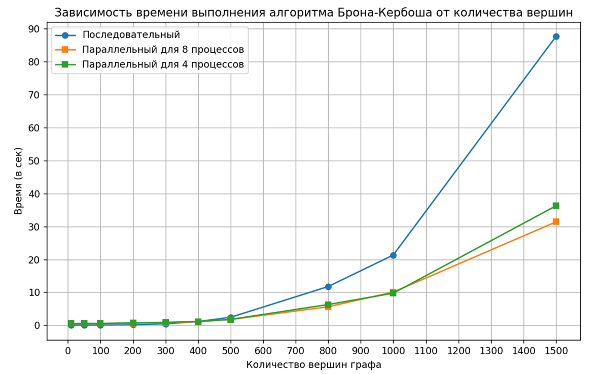
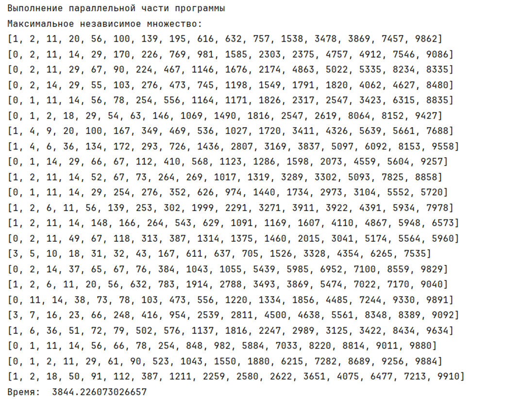

# Finding-the-maximal-independent-subset-in-a-graph

## **Поиск максимального независимого подмножества в графе**

Задача о независимом множестве относится к классу NP-полных задач в области теории графов. 
Алгоритм Брона - Кербоша — метод для поиска максимальных по включению независимых множеств вершин неориентированного графа.

Будем называть множество максимальным независимым, если к этому множеству нельзя добавить никакую другую вершину из графа с сохранением независимости.

### **_Зависимость времени выполнения алгоритма Брона-Кербоша от количества вершин на 8 и 4 процессорах_**

### **_Результат выполнения параллельного алгоритма для графа с 10 000 вершинами_**

